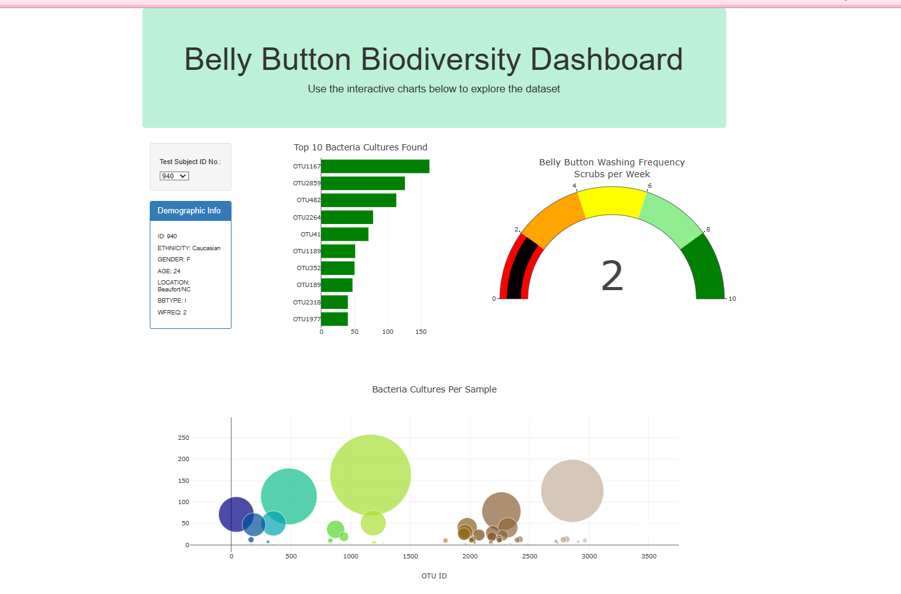

# Plotly-Belly-Button-Biodiversity

# Project Overview

In this module, we learned about Rosa, a researcher interested in discovering and documenting bacteria found in the belly button of the human body.  Rosa collected samples from volunteers across the country.  Each participant was given an id number that can be used to look up which bacteria species are found in their belly button. 

## *Purpose*
The purpose of this project was to build an interactive dashboard that can be used to explore the belly button biodiversity dataset.  This way, both researchers and volunteers can look up sample results. 

To complete the challenge, we were instructed to create a dashboard using HTML and JavaScript in VS Code.  A web browser to view and debug our visualizations.  A Git Bash terminal and GitHub. 

Furthermore, the Plotly JavaScript library was used to create interactive data visualization for the web using the D3.json() function to fetch external data.  The data was then parsed in JSON format, manipulated using JavaScript, and eventually deployed to a GitHub page.

## *Figure 1*

Figure 1 provides a glance of the interactive dashboard with ID 940's data displayed on the dropdown menu.

# Summary

Overall, I would recommend looking at the data from different samples.  Results vary between individuals from one bacterium to many.

